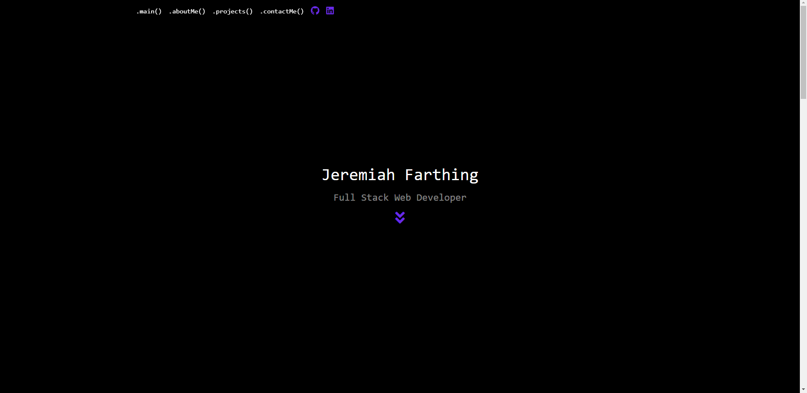
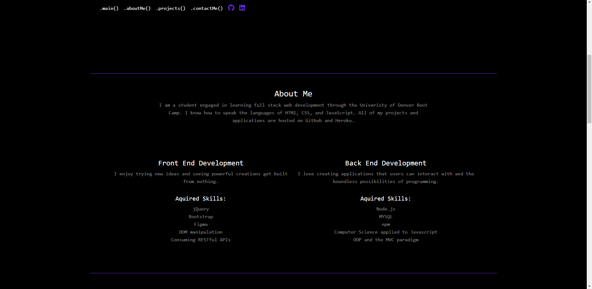
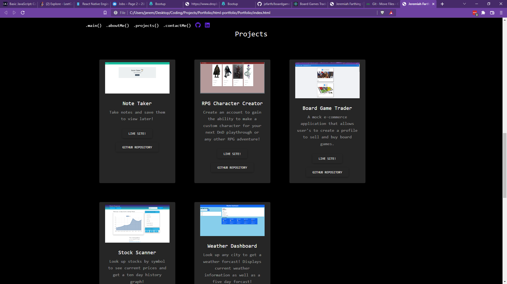
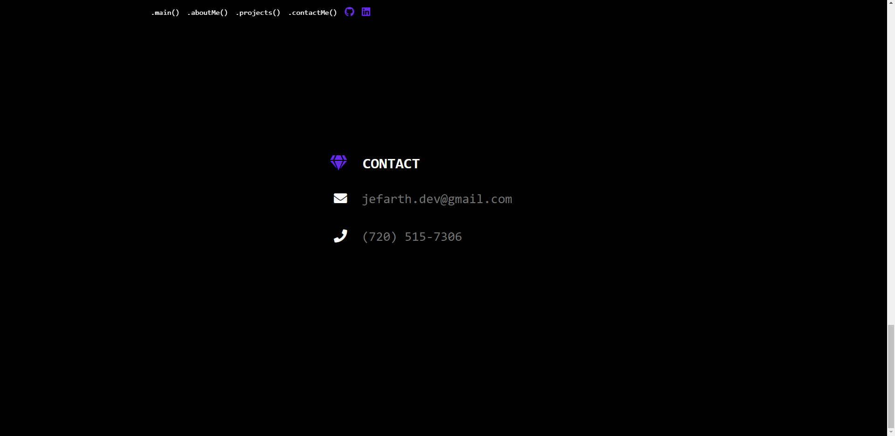

# Welcome to my portfolio!
  

  ## Description
This is my portfolio page. Please feel free to look around and check out the live page [here](https://jefarth.github.io/Portfolio/).

## Table of Contents 
* [Screenshots](#screenshots)
* [License](#license)
* [Contributing](#contributing)
* [Questions](#questions)

***
## Screenshots

## License
This project is licensed under the MIT License.

## Contributing or Questions
Contributing or Questions: Please follow below to view my contact information for any questions you want to ask.

## Contact Information
If you have any questions about the repo, please contact "jefarth" directly at jefarth.dev@gmail.com or leave a message at (720) 515-7306‬.